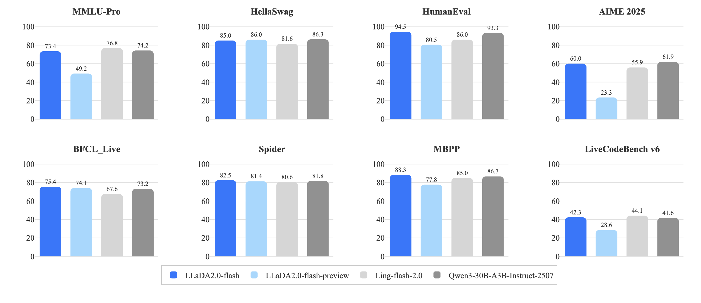

# LLaDA2.0: Scaling Up Diffusion Language Models to 100B

<h4 align="center">
  

</h4>

## Model Introduction

We are thrilled to introduce **LLaDA2.0**, a milestone series of discrete diffusion Large Language Models (dLLMs) from the Ant Group. The LLaDA2.0 family, featuring **LLaDA2.0-mini (16B)** and **LLaDA2.0-flash (100B)** with a Mixture-of-Experts (MoE) architecture, marks the first time diffusion models have been scaled to the **100-billion parameter level**.

### Key Features
- **🚀 Scaled to 100B Parameters**: LLaDA2.0-flash is the largest diffusion language model to date, demonstrating exceptional performance on code generation and complex instruction-following tasks.
- **⚡ 2.1x Inference Acceleration**: Leveraging a parallel decoding mechanism, LLaDA2.0-flash-CAP achieves an inference speed of up to **535 tokens/s**, significantly outpacing comparable AR models.
- **🔍 Fully Open Source**: The model weights for both the 16B and 100B versions, along with associated training code, are fully open-sourced on Hugging Face.

  <picture>
    
  </picture>

### Model Variants

| Model ID | Description | Hugging Face Link |
| --- | --- | --- |
| `inclusionAI/LLaDA2.0-mini` | Instruction-tuned model, ready for downstream applications. | [🤗 Model Card](https://huggingface.co/inclusionAI/LLaDA2.0-mini) |
| `inclusionAI/LLaDA2.0-flash` | Instruction-tuned model, ready for downstream applications. | [🤗 Model Card](https://huggingface.co/inclusionAI/LLaDA2.0-flash) |

## Evaluation Results

  <picture>
      
  </picture>

## Deployment and Usage

To make our 100B model practical, we have performed deep engineering optimizations. We built a custom inference engine based on **dInfer** and **SGLang**, which supports KV-Cache reuse and block-level parallel decoding. This makes LLaDA2.0 not just an academic achievement but a high-performance generation model ready for real-world deployment.

## License

This project is licensed under the terms of the [Apache License 2.0](https://www.apache.org/licenses/LICENSE-2.0).
